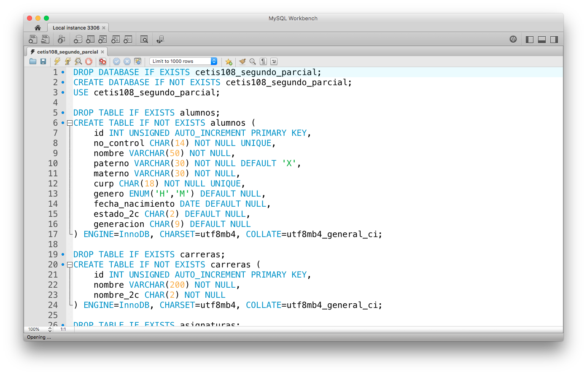
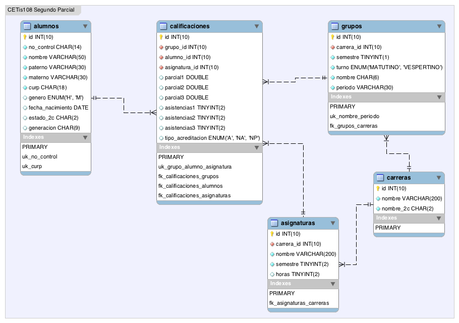

## Diseña y administra base de datos avanzadas

### Evaluación de segundo parcial

#### Requisitos
- Memoria USB
- Computadora
- Software instalado:
    - MySQL Server 5.6+
    - MySQL Workbench 6.3+

#### Instrucciones

1. Utilizando ***MySQL Workbench*** realiza una conexión al servidor local de ***MySQL*** y ejecuta el siguiente script: [cetis108_segundo_parcial.sql](files/cetis108_segundo_parcial.sql)

   

   > La ejecución del script creará la base de datos, las tablas y los registros de información necesarios para la práctica de evaluación.

2. La base de datos creada queda de la siguiente manera:

   

3. Realiza las siguientes consultas utilizando la base de datos `cetis108_segundo_parcial`, escribe las consultas en ***MySQL Workbench*** y al finalizar guarda el archivo con el nombre formado por tus INICIALES EN MAYÚSCULA seguido de _SegundoParcial.sql

   > Por ejemplo para mi caso sería `BAC_SegundoParcial.sql`

Decarga el archivo con las instrucciones [_SegundoParcial.sql](files/_SegundoParcial.sql)
```sql
-- ------------------------------------------ --
-- Segundo Parcial de base de datos avanzadas --
-- ------------------------------------------ --
-- Alumno:

/* 01: Realiza una consulta que muestre el nombre completo del alumno que inicie
 * por los apellidos, de todos los alumnos que estan registrados, ordenada
 * alfabeticamente. Ejemplo:
 * +--------------------------------+
 * | alumno                         |
 * +--------------------------------+
 * | ABOITE GONZALEZ JUSTIN GABRIEL |
 * | ALVAREZ LOPEZ JESUS PAUL       |
 * | ALVAREZ LOPEZ JOSE CARLOS      |
 * +--------------------------------+
 */
 
 
/* 02: Realiza una consulta que muestre el nombre de la carrera, asignatura y
 * semestre en que se imparte, ordenada por carrera, semestre y asignatura.
 * Ejemplo:
 * +----------------------------------+------------------------------+----------+
 * | carrera                          | asignatura                   | semestre |
 * +----------------------------------+------------------------------+----------+
 * | COMPONENTE BASICO Y PROPEDEUTICO | ÁLGEBRA                      |        1 |
 * | COMPONENTE BASICO Y PROPEDEUTICO | INGLÉS I                     |        1 |
 * | COMPONENTE BASICO Y PROPEDEUTICO | LECTURA, EXPRESIÓN ORAL ...  |        1 |
 * +----------------------------------+------------------------------+----------+
 */
 
 
/* 03: Realiza una consulta que muestre el nombre de grupo, el nombre de carrera,
 * turno, el semestre de los grupos registrados en el periodo 'SEMESTRAL 1 - 2018'
 * ordenados por carrera, semestre, turno y nombre de grupo.
 * Ejemplo:
 * +--------+----------------------------------+------------+----------+
 * | grupo  | carrera                          | turno      | semestre |
 * +--------+----------------------------------+------------+----------+
 * | 1AM-TC | COMPONENTE BASICO Y PROPEDEUTICO | MATUTINO   |        1 |
 * | 3AV-PR | PROGRAMACIÓN                     | VESPERTINO |        3 |
 * +--------+----------------------------------+------------+----------+
 */


/* 04: Realiza una consulta que muestre el nombre del alumno completo, de grupo
 * donde esta registrado, el periodo, pero solo los que te corresponden a ti.
 * Ejemplo: utilizando a Mariana para ejemplificar como en clase
 * +---------------------------+--------+--------------------+
 * | alumno                    | grupo  | periodo            |
 * +---------------------------+--------+--------------------+
 * | MARIANA CHAIDES CERVANTES | 1CM-TC | SEMESTRAL 1 - 2017 |
 * | MARIANA CHAIDES CERVANTES | 2AV-PR | SEMESTRAL 2 - 2017 |
 * | MARIANA CHAIDES CERVANTES | 3AV-PR | SEMESTRAL 1 - 2018 |
 * +---------------------------+--------+--------------------+
 */


/* 05: Realiza una consulta que muestre el nombre del alumno completo, grupo,
 * nombre de la asignatura y periodo, pero solo de las que hayas reprobado.
 * Ejemplo: utilizando ahora el caso de Justin para ejemplificar quedaría así
 * +--------------------------------+--------+------------+--------------------+
 * | alumno                         | grupo  | asignatura | periodo            |
 * +--------------------------------+--------+------------+--------------------+
 * | JUSTIN GABRIEL ABOITE GONZALEZ | 1DM-TC | LÓGICA     | SEMESTRAL 1 - 2017 |
 * | JUSTIN GABRIEL ABOITE GONZALEZ | 3AV-PR | BIOLOGÍA   | SEMESTRAL 1 - 2018 |
 * +--------------------------------+--------+------------+--------------------+
 */


/* 06: Realiza una consulta que muestre el nombre de la carrera, asignatura,
 * y semestre de la carrera de Contabilidad, ordenada por semestre y asignatura.
 * Ejemplo:
 * +--------------+---------------------------------------------+----------+
 * | carrera      | asignatura                                  | semestre |
 * +--------------+---------------------------------------------+----------+
 * | CONTABILIDAD | FORMULA ESTADOS FINANCIEROS DE LAS EMPRESAS |        2 |
 * | CONTABILIDAD | GEOMETRÍA Y TRIGONOMETRÍA                   |        2 |
 * | CONTABILIDAD | INGLÉS II                                   |        2 |
 * +--------------+---------------------------------------------+----------+
 */


/* 07: Realiza una consulta que muestre el nombre completo del alumno y nombre de
 * grupo, de las alumnas del grupo '2AV-PR' en el periodo 'SEMESTRAL 2 - 2017'.
 * Ejemplo:
 * +---------------------------------+--------+
 * | alumna                          | grupo  |
 * +---------------------------------+--------+
 * | MARIANA CHAIDES CERVANTES       | 2AV-PR |
 * | MELINA SADDAY PEREZ VIZCARRA    | 2AV-PR |
 * | MALITZIN ANAYANCI RUBIO CAMACHO | 2AV-PR |
 * +---------------------------------+--------+
 */


/* 08: Realiza una consulta que muestre tus calificaciones de primer parcial del
 * semestre actual Agosto 2018 - Enero 2019, ordenadas por nombre de asignatura.
 * Ejemplo: utilizando el caso de "Triple J" para ejemplificar quedaría así
 * +---------------------------------+--------+--------------------------+----------+
 * | alumno                          | grupo  | asignatura               | parcial1 |
 * +---------------------------------+--------+--------------------------+----------+
 * | JUDA JUAN PABLO TORRES ESPINOZA | 3AV-PR | DESARROLLA SOFTWARE ...  |        8 |
 * | JUDA JUAN PABLO TORRES ESPINOZA | 3AV-PR | INGLÉS III               |        7 |
 * | JUDA JUAN PABLO TORRES ESPINOZA | 3AV-PR | DISEÑA Y ADMINISTRA ...  |       10 |
 * | JUDA JUAN PABLO TORRES ESPINOZA | 3AV-PR | ÉTICA                    |        8 |
 * | JUDA JUAN PABLO TORRES ESPINOZA | 3AV-PR | GEOMETRÍA ANALÍTICA      |        9 |
 * | JUDA JUAN PABLO TORRES ESPINOZA | 3AV-PR | BIOLOGÍA                 |        8 |
 * +---------------------------------+--------+--------------------------+----------+
 */
 
```

   4. Una vez terminado tu examen guarda los cambios del archivo, cierralo y solicita al maestro la memoria USB donde harás entrega de tu archivo.

##### 👍 Buena suerte! 😎